# Architecture

Seven pipeline packages under `src/` (`intent`, `testbed`, `recorder`, `compiler`,
`cache`, `runner`, `metrics`), two leaves that are not pipeline stages (`src/shared/`,
`src/session/`), the `paragent` binary at `src/cli.ts`, four JSON Schemas in
`contracts/`, one throwaway harness in `experiments/gate-v1/`. Each pipeline package
has a spec doc under [`gate/`](./gate/) (or an ADR / privacy spec where noted); this
document owns the **chain** — what hands what to whom, under which contract, and where
the chain is measured vs merely wired.

Read [ROADMAP.md](./ROADMAP.md) for what to work on and [DEVELOPMENT.md](./DEVELOPMENT.md) for
how to run it. This document is the wiring diagram.

**Derived from code at commit `e4ab318`** (`main`, 2026-08-16): 13,618 lines of TypeScript in
`src/`, 2,363 in `experiments/`, 11,343 in `tests/` (`wc -l` over `*.ts`). Every claim below
was read out of the source at that commit, not out of a sibling doc. Where a sibling doc
disagrees with the code, the disagreement is recorded in
[Open questions](#open-questions--what-i-could-not-verify) rather than resolved here.

---

## The loop, in one diagram

Solid edges are wired in code. There are **no dashed “hop does not exist” edges left** —
bundle → cache write landed in [#166](https://github.com/DevToolie/Paragent/issues/166),
bundle → runner in [#62](https://github.com/DevToolie/Paragent/issues/62), cache read in
[#118](https://github.com/DevToolie/Paragent/issues/118). What remains open is measurement
(empty denominators, stub defaults), not missing pipes.

```mermaid
flowchart LR
  CLI["paragent binary<br/>src/cli.ts"]
  INTENT["intent<br/>src/intent/"]
  TB["testbed<br/>Grafana OSS @ pinned tag<br/>src/testbed/"]
  AUTH["SessionAuthorization<br/>src/session/consent.ts"]
  REC["recorder<br/>src/recorder/"]
  TRAJ["trajectory.json<br/>experiments/gate-v1/trajectories/"]
  COMP["compiler<br/>src/compiler/"]
  BUNDLE["compiled_trajectory bundle<br/>artifacts/compiled/*.bundle.json"]

  CACHE["cache<br/>src/cache/"]
  POOL["pool row<br/>pool_eligible=true"]
  TEN["tenant row<br/>pool_eligible=false"]

  PROG["CompiledProgram<br/>runner input shape"]
  FIX["hand-written fixture<br/>gate-v1/fixtures/compiled-program.json"]
  RUN["runner replay<br/>src/runner/replay.ts"]
  REP["repair<br/>assertion frozen"]
  BASE["gate:baseline<br/>fresh-baseline.ts"]
  COSTF["cost_fresh<br/>baseline.json"]
  NDJSON["metrics NDJSON<br/>gate-v1/out/metrics.ndjson"]
  REPORT["gate report<br/>gate-v1/out/report/*"]
  MATRIX["gate:matrix<br/>run-matrix.ts"]

  CLI -->|"record / compile / testbed"| REC
  CLI --> COMP
  CLI --> TB

  TB -->|"seeded HTTP surface; pins in scripts/testbed/matrix.json"| REC
  INTENT -->|"resolveTaskIntent() → task_key or MISS<br/>src/recorder/select-task.ts (#124)"| REC
  AUTH -->|"establishSession requires authorization<br/>ADR-0018 / SC-05"| REC
  REC -->|"trajectory.schema.json"| TRAJ
  TRAJ -->|"trajectory.schema.json"| COMP
  COMP -->|"cache-row.schema.json + assertion.schema.json<br/>wrapper has no $id"| BUNDLE

  BUNDLE -->|"paragent compile --to-cache<br/>src/cache/ingest.ts → writeCacheRow (#166)"| CACHE
  CACHE -->|"cache-row.schema.json"| POOL
  CACHE -->|"cache-row.schema.json"| TEN

  BUNDLE -->|"src/runner/program.ts (#62)"| PROG
  FIX -->|"default program when no bundle is passed"| PROG
  CACHE -->|"gate:matrix --from-cache<br/>resolveProgram (#118)"| PROG
  MATRIX -->|"drives"| RUN
  PROG -->|"cache-row + assertion shapes"| RUN
  RUN -->|"on assertion failure, max 2 per run"| REP
  REP -->|"corrected_action only, never the assertion"| RUN
  RUN -->|"metrics.schema.json"| NDJSON
  NDJSON -->|"PRD §9 aggregates, no_data-safe"| REPORT

  AUTH -->|"same consent gate"| BASE
  BASE -->|"FreshBaselineRunner<br/>writes baseline.json"| COSTF
  COSTF -->|"gate:matrix --cost-fresh<br/>loadCostFreshBaseline (#39 harness)"| MATRIX
  MATRIX -->|"optional --from-cache"| CACHE
```

### Reading the diagram

**Where does a trajectory come from, and what reads it?** The recorder
(`src/recorder/cli.ts`, also `paragent record`) drives Playwright against either the bundled
HTML fixture or a live `--base-url`, and writes a `trajectory.schema.json` document — by default
to `experiments/gate-v1/trajectories/`. Before login it must hold a `SessionAuthorization` from
`SessionAuthorization.authorize` ([ADR-0018](./decisions/ADR-0018-session-consent-gate.md)).
The compiler (`src/compiler/cli.ts`, `npm run compile -- --in <trajectory.json>`, also
`paragent compile`) is the only trajectory reader: it turns each step into one cache row with a
synthesized assertion and writes a `compiled_trajectory` bundle to `artifacts/compiled/`.

**Closed breaks (were the two dashed edges).** Both hops the prose elsewhere once implied were
wired are now wired:

1. ~~**The bundle never reaches the cache.**~~ **Closed by
   [#166](https://github.com/DevToolie/Paragent/issues/166).** `paragent compile --to-cache <dir>`
   routes every row through the authority via `src/cache/ingest.ts` → `writeCacheRow`. The read
   half landed earlier with [#118](https://github.com/DevToolie/Paragent/issues/118)
   (`gate:matrix --from-cache`); `experiments/gate-v1/run-matrix.ts` imports `JsonlCacheStore` /
   `resolveProgram`. End-to-end coverage:
   `tests/integration/cache-ingest-bundle.test.ts` and
   `tests/integration/cache-resolve-program.test.ts`.

   **Pre-check and authority now agree on pool eligibility
   ([#170](https://github.com/DevToolie/Paragent/issues/170) /
   [ADR-0019](./decisions/ADR-0019-pool-precheck-topology.md)).** The pre-check used to refuse
   any chain containing a `tenant_scoped` locator even when a pool-safe `structural` sibling
   survived; `buildPoolRow` strips and pools the rest. On the live bundle that understated
   shareable rows as 1/12 vs the authority's 7/12. Both now stamp **7/12**. Rather than
   maintaining a second copy of the vocabulary, `decidePoolEligibility` now calls the
   authority's own `checkLocatorTaint` (`src/cache/taint.ts`) for both the chain and the
   assertion target — the same predicate `classifyLocators` and `assertionHasTenantLiteral`
   use. The direction invariant (pre-check never looser) remains pinned by
   `tests/integration/live-bundle-pool.test.ts`.

2. ~~**The bundle never reaches the runner.**~~ **Closed by
   [#62](https://github.com/DevToolie/Paragent/issues/62).** The runner consumes
   `CompiledProgram` (`src/runner/types.ts`); the adapter lives in `src/runner/program.ts` and
   `npm run gate:matrix -- --program <bundle>` replays a committed bundle directly. The
   hand-written `experiments/gate-v1/fixtures/compiled-program.json` remains the default,
   because it is the only program that runs without a recording.

**A new entry point, ahead of the recorder.** `src/intent/` ([#124](https://github.com/DevToolie/Paragent/issues/124),
[ADR-0015](./decisions/ADR-0015-task-identity-and-intent-resolution.md)) resolves a
natural-language goal to the `task_key` that names it, or a typed MISS.
`src/recorder/cli.ts` calls it through
`src/recorder/select-task.ts::resolveTaskKeyForRecording` before falling back to an explicit
`--task-key`. **Not shown as an edge into `CACHE`:** resolving intent in front of
`gate:matrix --from-cache` is not wired yet (ADR-0015 Open Questions).

**Fresh-baseline entry (harness only).** `npm run gate:baseline`
(`experiments/gate-v1/fresh-baseline.ts`) measures what a model costs to do the gate task from
scratch and writes `baseline.json`. `gate:matrix --cost-fresh <path>` loads that via
`loadCostFreshBaseline`. The **mechanism exists**; a live measured denominator does not —
[#39](https://github.com/DevToolie/Paragent/issues/39) is still open, and dry-run / stub paths
are explicitly `usable: false` / zero-cost.

---

## Package table

| Package | Responsibility | Public entry point | Contract read | Contract written | Spec doc |
| --- | --- | --- | --- | --- | --- |
| `src/cli.ts` | `paragent` binary: dispatches `record` / `compile` / `testbed` to the package CLIs | `package.json` `"bin": { "paragent": "dist/src/cli.js" }` | none | none | — |
| `src/intent/` | Resolve a natural-language goal to a `task_key`, or a typed MISS — normalized exact match against a known-task catalog, behind a swappable `IntentMatcher` (#124) | `src/intent/index.ts` (library only — called from `src/recorder/select-task.ts`) | none | none — `task_key` is an opaque string handed to a caller, not a contract field this package owns | [decisions/ADR-0015](./decisions/ADR-0015-task-identity-and-intent-resolution.md) |
| `src/testbed/` | Boot + seed Grafana OSS at a pinned tag: compose project, provisioning overlay, HTTP seed | `src/testbed/index.ts`; CLI `src/testbed/cli.ts` (`npm run testbed`, `paragent testbed`) | `scripts/testbed/matrix.json` (not a JSON Schema) | none | [gate/testbed.md](./gate/testbed.md) |
| `src/recorder/` | Capture a Playwright run as parameterised steps with ranked locator candidates; refuse literal secrets; establish sessions only through `SessionAuthorization` | `src/recorder/index.ts`; CLI `src/recorder/cli.ts` (`npm run recorder`, `paragent record`) | none | `trajectory.schema.json` | [gate/recorder.md](./gate/recorder.md) |
| `src/compiler/` | One cache row per step: locator fallback chain, synthesized assertion, fail-closed `pool_eligible` pre-check; optional `--to-cache` ingest | `src/compiler/index.ts`; CLI `src/compiler/cli.ts` (`npm run compile`, `paragent compile`) | `trajectory.schema.json` | `cache-row.schema.json`, `assertion.schema.json` | [gate/compiler.md](./gate/compiler.md) |
| `src/cache/` | Write-time privacy boundary: allowlist, locator taint, pool/tenant row split, canary pipeline; append-only JSONL store (#63); confidence / invalidation / repair rewrite (#64); program resolve (#120/#118); bundle ingest through the authority (#166) | `src/cache/index.ts` (library — `paragent compile --to-cache` and `gate:matrix --from-cache` are the product callers) | `cache-row.schema.json`, `assertion.schema.json` (inspected for pool safety) | `cache-row.schema.json` | [privacy/boundary-spec.md](./privacy/boundary-spec.md), [gate/cache.md](./gate/cache.md) |
| `src/runner/` | Replay a compiled program in Playwright; repair actions only on failure; emit measured metrics; fresh-baseline client/runner for §9 denominator harness | `src/runner/index.ts` (library — driven by `experiments/gate-v1/run-matrix.ts` and `fresh-baseline.ts`) | `cache-row.schema.json`, `assertion.schema.json` shapes (via `CompiledProgram`) | none directly — emits through `src/metrics/` | [gate/runner.md](./gate/runner.md), [gate/fresh-baseline.md](./gate/fresh-baseline.md) |
| `src/metrics/` | Cost arithmetic, NDJSON emitter, PRD §9 aggregates that report `no_data` on an empty denominator (including cache hit-rate) | `src/metrics/index.ts` (library only) | `metrics.schema.json` (`readMetricNdjson`) | `metrics.schema.json` | §9 sections in [prd/PRD-trajectory-cache-v0.2.md](./prd/PRD-trajectory-cache-v0.2.md) |
| `src/shared/` | **Not a pipeline stage.** In-page JS source strings two capture sites must run identically — today the `visible_landmarks` enumeration | `src/shared/index.ts` (library only) | none | none — feeds the `trajectory.schema.json` `visible_landmarks` field written by the recorder | see below |
| `src/session/` | **Not a pipeline stage.** Two capabilities: (1) SC-05 consent — `SessionAuthorization` gates every `establishSession` call (recorder CLI, `live-run.ts`, `fresh-baseline.ts`); (2) SC-01 encrypted-at-rest session persistence (`store` / `persist` / `keys`) — still **no product caller** that saves session material | `src/session/index.ts` (library) | none | none — consent is in-memory; encryption is a binary envelope, not a repo contract | [privacy/session-state-encryption.md](./privacy/session-state-encryption.md), [ADR-0018](./decisions/ADR-0018-session-consent-gate.md) |
| `experiments/gate-v1/` | Throwaway harness: walk the version list, emit rows, render the report, optional fresh baseline. **Not a product API** | `npm run gate:matrix`, `npm run gate:baseline`, `npm run gate:report` | `metrics.schema.json`, `scripts/testbed/matrix.json` (via `src/testbed/matrix.ts`) | `metrics.schema.json` | [experiments/gate-v1/README.md](../experiments/gate-v1/README.md) |

`src/intent/` has no spec doc under `gate/` either — it is not a stage that transforms one
contract into another, so [ADR-0015](./decisions/ADR-0015-task-identity-and-intent-resolution.md)
is both the design record and the spec, the same shape `src/cache/` takes with
`privacy/boundary-spec.md` below.

`src/cache/` has no sole spec under `gate/`; its contract is
[privacy/boundary-spec.md](./privacy/boundary-spec.md), [gate/cache.md](./gate/cache.md), and the
merge-blocking canary (`tests/canary/`).

### The one non-pipeline package (shared)

`src/shared/` (added by [#74](https://github.com/DevToolie/Paragent/issues/74)) is not a stage
in the chain and takes no contract. It is a leaf: it imports nothing from `src/` and holds
**in-page JS source strings** that two capture sites must run identically. Today that is one
file, `landmarks.ts` — the enumeration behind `visible_landmarks`, run by both
`src/recorder/fingerprint.ts` and `src/runner/page-state.ts`.

It exists because the alternative was worse in both directions: `src/runner/` importing from
`src/recorder/` inverts the pipeline dependency, and the reverse is no better. The snippets are
strings rather than functions on purpose — see the [invariants](#invariants-that-must-not-break)
below.

Keep it a leaf. Something belongs here only if it runs inside the browser *and* two packages
must run the identical copy; anything else goes in the package that owns it. A `src/shared/`
that grows general utilities is a dependency cycle waiting to happen.

### Contracts

All four live in [`contracts/`](../contracts/) with `$id`s under `https://paragent.dev/contracts/`.

| Contract | Written by | Read by |
| --- | --- | --- |
| `trajectory.schema.json` | recorder | compiler |
| `assertion.schema.json` | compiler | runner, cache |
| `cache-row.schema.json` | compiler, cache | runner *(by shape — via `CompiledProgram` / `resolveProgram`)* |
| `metrics.schema.json` | runner via metrics | metrics aggregates, gate report |

The `compiled_trajectory` bundle wrapper is the one pipeline artifact with **no** schema —
`bundle_kind`, `source_trajectory_id`, `compiler{}`, `rows[]` are a compiler packaging
convention. Its rows and assertions are validated (`validateCompiledBundle` in
`src/compiler/validate.ts` Ajv-checks each row against `cache-row.schema.json` and each
assertion against `assertion.schema.json`); the wrapper around them is not.

---

## Artifact table

| Artifact | Produced by | Committed? |
| --- | --- | --- |
| `experiments/gate-v1/trajectories/*.json` | `npm run recorder` / `paragent record` (default `--out`) | **committed** — fixture login trajectory plus live gate-task recording |
| `artifacts/compiled/*.bundle.json` | `npm run compile` / `paragent compile` (default `--out`) | **committed** — example bundle plus live gate-task bundle |
| `experiments/gate-v1/out/metrics.ndjson` | `npm run gate:matrix` (`MetricsEmitter.flush`) | gitignored (`experiments/gate-v1/out/`) |
| `experiments/gate-v1/out/report/report.{json,csv,html}`, `amortized.svg` | `npm run gate:report` | gitignored |
| `experiments/gate-v1/out/fresh-baseline/baseline.json` | `npm run gate:baseline` | gitignored — protocol record for `--cost-fresh`; dry-run writes are `usable: false` |
| `scripts/testbed/.runtime/<version>/provisioning/` | `prepareProvisioningOverlay` on every testbed invocation, including `--dry-run` | gitignored (`scripts/testbed/.gitignore`) |
| `<cache dir>/pool.jsonl`, `<cache dir>/tenant.jsonl` | `JsonlCacheStore.write` via `writeCacheRowPair` / `ingestBundle` | gitignored (`.cache/` plus both file names by name) — **`tenant.jsonl` holds tenant-scoped rows by design; committing one is a privacy incident** |
| `experiments/gate-v1/fixtures/compiled-program.json` | hand-written | **committed** — stands in for a real compiled program when no bundle is passed |
| `experiments/gate-v1/out/matrix-run.json` | `npm run gate:matrix` | gitignored — selection, versions walked, versions skipped with reason |

Generated output that is gitignored **must stay that way**. The recorder's own artifacts are
committed on purpose: they are fixtures, and `assertNoLiteralSecrets` runs on every write
(`src/recorder/session.ts`) so a committed trajectory cannot carry a typed value.

---

## What is real vs stubbed today

The section a new agent needs most. Blunt, and current as of `e4ab318`.

| # | What looks finished but is not | Evidence in code | Consequence | Issue |
| --- | --- | --- | --- | --- |
| 1 | **Repair defaults to a stub.** `StubRepairModelClient` always returns `corrected_action: null`, `tokens_in: 0`, `tokens_out: 0`. `AnthropicRepairModelClient` exists (`src/runner/repair-anthropic.ts`, #27 closed) and `gate:matrix --repair-model` can construct it, but `ReplayRunner` still defaults to the stub | `src/runner/repair.ts`; `src/runner/replay.ts` (`repairClient ?? new StubRepairModelClient()`); `experiments/gate-v1/run-matrix.ts` | Default self-heal rate is structurally 0 and `cost_repair` tokens are structurally 0 unless a caller opts into Anthropic. **Self-heal remains unmeasured** as a gate number | default wiring; measurement still open |
| 2 | **`cost_fresh` is wired and still unmeasured.** Mechanism: `FreshBaselineRunner`, `npm run gate:baseline`, `gate:matrix --cost-fresh`, `loadCostFreshBaseline`. `ReplayRunner` still defaults `costFresh` to `zeroCost()` when the flag is absent | `experiments/gate-v1/fresh-baseline.ts`; `run-matrix.ts` `loadCostFreshBaseline`; `src/runner/fresh-baseline*.ts` | The §9 kill line "repair cost ≥ 70% of fresh" has no measured denominator until a live baseline is produced and passed in. Aggregates report `status: no_data` rather than a number. Since [#123](https://github.com/DevToolie/Paragent/issues/123) / [ADR-0010](./decisions/ADR-0010-amortization-cost-model.md) these are two fields (`cost_fresh` vs `cost_program_build`), not one read two ways | [#39](https://github.com/DevToolie/Paragent/issues/39) |
| 3 | **Live matrix is wired; it is still not a gate number.** `npm run gate:matrix` brings up each pin, drives Chromium, emits real outcomes; `--runs` exists; `--dry-run` remains for the no-Docker path CI uses | `experiments/gate-v1/live-run.ts`, `run-matrix.ts` | One (or even N) runs per version is not automatically a §9 sample (≥42 runs / ≥400 step-executions). Dry-run outcomes remain hard-coded `PASS` with zero tokens. **Not a measurement of the thesis** | — |
| 4 | ~~`versions.json` is a placeholder, not the matrix.~~ **Fixed by [#26](https://github.com/DevToolie/Paragent/issues/26)** — deleted; `run-matrix.ts` reads `scripts/testbed/matrix.json` through `src/testbed/matrix.ts` | `experiments/gate-v1/run-matrix.ts` | The harness walks the real ADR-0003 pins and records skips in `out/matrix-run.json`. **Still not a measurement** when run under `--dry-run` | — |
| 5 | **Cache read+write are wired; hit-rate is `no_data`.** Write: `compile --to-cache` → `ingestBundle`. Read: `gate:matrix --from-cache` → `resolveProgram`. Confidence update path exists (`applyOutcome` / `createCacheUpdateSink`, #64) | `src/cache/ingest.ts`, `resolve.ts`, `confidence.ts`, `update.ts`; `run-matrix.ts` | A hit is *representable* (`program_source == "cache"`). **No hit-rate number exists** — `--from-cache` is opt-in, nothing in CI passes it against a populated cache, so `cacheHitRate()` reports `no_data`. `gate:matrix` also does not pass `createCacheUpdateSink` today, so a live matrix run does not move confidence on disk even though the API exists | hit-rate measurement; sink wiring optional |
| 6 | ~~**Confidence never moves.**~~ **False as of #64.** `applyOutcome` updates `confidence` / counts / invalidation / repair rewrite; integration and canary tests exercise it | `src/cache/confidence.ts`, `src/cache/update.ts` | Behaviour exists; it is **advisory** (does not gate the measurement — [ADR-0009](./decisions/ADR-0009-cache-confidence.md)) and unused by the default matrix path (row 5) | — |
| 7 | ~~**Bundle → cache / bundle → runner unwired.**~~ **Closed** (#166 write, #62 adapter, #118 read) | compiler CLI + `run-matrix.ts` import `src/cache/`; `src/runner/program.ts` | Residual: compiler pre-check vs authority pool-yield divergence on the live bundle — [#170](https://github.com/DevToolie/Paragent/issues/170) | [#170](https://github.com/DevToolie/Paragent/issues/170) |
| 8 | ~~**Cache hit-rate missing from §9.**~~ **Added by [#67](https://github.com/DevToolie/Paragent/issues/67)** — `cacheHitRate()` is a reported section | `src/metrics/aggregate.ts` | **All five §9 secondary metrics are reported.** The number itself is `no_data` until something runs with `--from-cache` against a populated cache — honest empty denominator, not a failure | [#39](https://github.com/DevToolie/Paragent/issues/39) (fresh) + unmeasured hit-rate |

What **is** real, and should not be re-litigated: the testbed boots and seeds a pinned Grafana
tag on a live daemon and is CI-smoked on every PR ([gate/testbed.md](./gate/testbed.md)); the
recorder captures and refuses literal secrets; session establishment is consent-gated; the
compiler synthesizes an assertion per step and validates its output against two schemas; the
cache write boundary works and is canary-tested merge-blocking; bundle ingest and program
resolve exist; the replay and repair loops, assertion freezing, and metric emission all execute;
the aggregates compute correctly and report `no_data` honestly.

---

## Invariants that must not break

1. **Assertions are frozen during repair.** `deepFreeze(structuredClone(step.assertion))`
   before the loop, then `assertAssertionUnchanged` is called after *every* proposal and
   again after every retry (`src/runner/replay.ts`; `src/runner/repair.ts`). A proposal may
   supply `corrected_action` and nothing else. A repair loop that can weaken its own check
   makes replay-validity self-fulfilling and destroys the gate number.
2. **Pool writes fail closed.** `writeCacheRow` refuses — by throwing
   `CacheWriteRejectedError` — a pool-eligible row carrying a `tenant_scoped` locator, a
   free-text locator, or a tenant literal in an assertion (`src/cache/write.ts`). A caller
   asking for `pool_eligible: true` on a row that fails the checks gets an error, not a
   downgrade. Do not add a store path that bypasses it.
3. **Typed values never enter a trajectory.** Every value becomes a parameter slot:
   `parameters: { password: "secret_ref" }`, never the value. `assertNoLiteralSecrets` runs on
   the serialized trajectory before it is written and throws on `"value":`, `Set-Cookie`,
   `cookies`, `localStorage`, `sessionStorage`, or a typed `password`
   (`src/recorder/redact.ts`). The schema says the same thing normatively: *"NEVER
   contains literal typed values, cookies, or storage."*
4. **Aggregates report `no_data`, never an invented rate.** Every §9 section returns
   `value: null, status: "no_data"` on a zero denominator instead of `0`
   (`src/metrics/aggregate.ts`). An empty denominator is not a zero rate. The report generator
   does the same at the file level — missing NDJSON yields a `no_data` scaffold and an SVG that
   says so.
5. **The gate harness is throwaway.** `experiments/gate-v1/` must not be promoted into a
   product API or imported by `src/`. Today the dependency runs the correct direction only:
   `experiments/` imports `src/`, never the reverse.
6. **In-page snippets stay strings, and there is one of each.** Both capture sites pass their
   evaluate body to the browser as text — the recorder via `new Function`, the runner via
   `page.evaluate("...")` — because esbuild's `keepNames` wraps named function expressions in
   `__name(...)`, which does not exist in the browser. A serialized callback throws
   `ReferenceError: __name is not defined`. So the shared unit is a **source string**
   (`src/shared/landmarks.ts`), and it is shared rather than copied — two copies of the
   landmark walk is exactly what made the recorder and the runner report different pages (#74).
   `tests/unit/landmarks.test.ts` fails if a second copy of the predicate appears anywhere
   under `src/`.
7. **Session establishment requires consent authorization.** `establishSession`
   (`src/recorder/preamble.ts`) takes `target: SessionAuthorization`, not a raw `baseUrl`
   string. The only way to obtain one is `SessionAuthorization.authorize(baseUrl, consent?)`
   (`src/session/consent.ts`), which refuses a non-local target with no
   `ConsentAcknowledgment` ([ADR-0018](./decisions/ADR-0018-session-consent-gate.md), SC-05).
   Do not reintroduce a string door. Call sites today: recorder CLI, `live-run.ts`,
   `fresh-baseline.ts` — the type system already caught a missed site once (#164).

---

## Open questions / what I could not verify

- ~~**`npm run lint:docs` does not exist.**~~ **Retired** — the script is in `package.json`,
  runs as part of `npm run ci`, and [#53](https://github.com/DevToolie/Paragent/issues/53) is
  closed. This refresh was checked with `npm run lint:docs`.
- ~~**[DEVELOPMENT.md](./DEVELOPMENT.md) showed cache write as wired when the code had no
  callers.**~~ **Retired against `e4ab318`** — `compile --to-cache` / `ingestBundle` and
  `gate:matrix --from-cache` are real. DEVELOPMENT's data-flow sketch is directionally correct
  for that hop; it still omits intent resolution, the consent gate, `--from-cache`, and
  `gate:baseline` (runbook lag, not a contradiction about an unwired cache).
- **[contracts/README.md](../contracts/README.md) lists `cache-row.schema.json` as read by
  "B4"** (the runner). True by shape via `CompiledProgram` / `resolveProgram`; the runner does
  not Ajv-load the schema file itself. Same adjudication as before, milder now that the cache
  read path exists.
- **Whether `compiled_trajectory` should become a fifth contract with an `$id`.**
  [gate/compiler.md](./gate/compiler.md) calls the wrapper "a B3 packaging convention…not a
  contract `$id` yet" and [gate/runner.md](./gate/runner.md) lists the same as an open
  question. The bundle→runner hop closed with an adapter (`src/runner/program.ts`), not a new
  schema — this may stay unresolved.
- **Whether `CompiledProgram` or `CompiledTrajectoryBundle` remains the long-term runner
  input shape.** Both still exist as hand-maintained TypeScript interfaces
  (`src/runner/types.ts`, `src/compiler/types.ts`) with an adapter between them. The adapter
  is shipped; which type is canonical long-term is not decided here.
- **Line counts** are `wc -l` over `*.ts` at `e4ab318` (13,618 `src/` / 2,363 `experiments/` /
  11,343 `tests/`). Sibling docs that cite older totals are stale; none of the counts are
  load-bearing.
- **Nothing in this document is a measurement.** No gate number exists. The diagram shows
  which pipes are connected, not that anything meaningful has flowed through them at sample
  size.
