# Architecture

Six pipeline packages under `src/` plus one shared leaf, four JSON Schemas in `contracts/`, one
throwaway harness in `experiments/gate-v1/`. Each pipeline package has a spec doc under
[`gate/`](./gate/); this document owns the **chain** — what hands what to whom, under which
contract, and where the chain is not actually connected yet.

Read [ROADMAP.md](./ROADMAP.md) for what to work on and [DEVELOPMENT.md](./DEVELOPMENT.md) for
how to run it. This document is the wiring diagram.

**Derived from code at commit `6ad7151`** (`main`, 2026-07-25): 5,339 lines of TypeScript in
`src/`, 291 in `experiments/`, 807 in `tests/`. Every claim below was read out of the source at
that commit, not out of a sibling doc. Where a sibling doc disagrees with the code, the
disagreement is recorded in [Open questions](#open-questions--what-i-could-not-verify) rather
than resolved here.

---

## The loop, in one diagram

Solid edges are wired in code. **Dashed red edges are hops that do not exist yet** — the
artifact on the left is never handed to the box on the right by any code path outside tests.

```mermaid
flowchart LR
  TB["testbed<br/>Grafana OSS @ pinned tag<br/>src/testbed/"]
  REC["recorder<br/>src/recorder/"]
  TRAJ["trajectory.json<br/>experiments/gate-v1/trajectories/"]
  COMP["compiler<br/>src/compiler/"]
  BUNDLE["compiled_trajectory bundle<br/>artifacts/compiled/*.bundle.json"]

  CACHE["cache write<br/>src/cache/"]
  POOL["pool row<br/>pool_eligible=true"]
  TEN["tenant row<br/>pool_eligible=false"]

  PROG["CompiledProgram<br/>runner input shape"]
  FIX["hand-written fixture<br/>gate-v1/fixtures/compiled-program.json"]
  RUN["runner replay<br/>src/runner/replay.ts"]
  REP["repair<br/>assertion frozen"]
  NDJSON["metrics NDJSON<br/>gate-v1/out/metrics.ndjson"]
  REPORT["gate report<br/>gate-v1/out/report/*"]

  TB -->|"seeded HTTP surface; pins in scripts/testbed/matrix.json"| REC
  REC -->|"trajectory.schema.json"| TRAJ
  TRAJ -->|"trajectory.schema.json"| COMP
  COMP -->|"cache-row.schema.json + assertion.schema.json<br/>wrapper has no $id"| BUNDLE

  BUNDLE -.->|"NOT WIRED — see break 1"| CACHE
  CACHE -->|"cache-row.schema.json"| POOL
  CACHE -->|"cache-row.schema.json"| TEN

  BUNDLE -->|"src/runner/program.ts (#62)"| PROG
  FIX -->|"default program when no bundle is passed"| PROG
  PROG -->|"cache-row + assertion shapes"| RUN
  RUN -->|"on assertion failure, max 2 per run"| REP
  REP -->|"corrected_action only, never the assertion"| RUN
  RUN -->|"metrics.schema.json"| NDJSON
  NDJSON -->|"PRD §9 aggregates, no_data-safe"| REPORT

  linkStyle 4 stroke:#c00,stroke-width:2px
```

### Reading the diagram

**Where does a trajectory come from, and what reads it?** The recorder
(`src/recorder/cli.ts`) drives Playwright against either the bundled HTML fixture or a live
`--base-url`, and writes a `trajectory.schema.json` document — by default to
`experiments/gate-v1/trajectories/`. The compiler (`src/compiler/cli.ts`, `npm run compile --
--in <trajectory.json>`) is the only reader: it turns each step into one cache row with a
synthesized assertion and writes a `compiled_trajectory` bundle to `artifacts/compiled/`.

**The two breaks.** Two hops the prose elsewhere implies are wired are not:

1. **The bundle never reaches the cache.** Nothing outside `src/cache/` and `tests/` imports
   the cache package — verified by grepping every import in `src/` and `experiments/`. The
   `pool_eligible` flag on a bundle row comes from the compiler's own pre-check
   (`src/compiler/pool.ts`, `decidePoolEligibility`), *not* from the authoritative write-time
   boundary (`src/cache/write.ts`, `writeCacheRow`). Both fail closed, and the compiler's own
   doc calls itself a pre-check — but today nothing calls the authority.
2. ~~**The bundle never reaches the runner.**~~ **Closed by
   [#62](https://github.com/DevToolie/Paragent/issues/62).** The runner consumes
   `CompiledProgram` (`src/runner/types.ts`), a different shape from
   `CompiledTrajectoryBundle`; the adapter now lives in `src/runner/program.ts` and
   `npm run gate:matrix -- --program <bundle>` replays a committed bundle directly. The
   hand-written `experiments/gate-v1/fixtures/compiled-program.json` remains the default, because
   it is the only program that runs without a recording.

Issue [#52](https://github.com/DevToolie/Paragent/issues/52) (end-to-end integration test:
record → compile → cache-write → replay) is the issue that closes both.

---

## Package table

| Package | Responsibility | Public entry point | Contract read | Contract written | Spec doc |
| --- | --- | --- | --- | --- | --- |
| `src/testbed/` | Boot + seed Grafana OSS at a pinned tag: compose project, provisioning overlay, HTTP seed | `src/testbed/index.ts`; CLI `src/testbed/cli.ts` (`npm run testbed`) | `scripts/testbed/matrix.json` (not a JSON Schema) | none | [gate/testbed.md](./gate/testbed.md) |
| `src/recorder/` | Capture a Playwright run as parameterised steps with ranked locator candidates; refuse literal secrets | `src/recorder/index.ts`; CLI `src/recorder/cli.ts` (`npm run recorder`) | none | `trajectory.schema.json` | [gate/recorder.md](./gate/recorder.md) |
| `src/compiler/` | One cache row per step: locator fallback chain, synthesized assertion, fail-closed `pool_eligible` pre-check | `src/compiler/index.ts`; CLI `src/compiler/cli.ts` (`npm run compile`) | `trajectory.schema.json` | `cache-row.schema.json`, `assertion.schema.json` | [gate/compiler.md](./gate/compiler.md) |
| `src/cache/` | Write-time privacy boundary: allowlist, locator taint, pool/tenant row split, canary pipeline | `src/cache/index.ts` (library only — no CLI) | `cache-row.schema.json`, `assertion.schema.json` (inspected for pool safety) | `cache-row.schema.json` | [privacy/boundary-spec.md](./privacy/boundary-spec.md) |
| `src/runner/` | Replay a compiled program in Playwright; repair actions only on failure; emit measured metrics | `src/runner/index.ts` (library only — driven by `experiments/gate-v1/run-matrix.ts`) | `cache-row.schema.json`, `assertion.schema.json` shapes (via `CompiledProgram`) | none directly — emits through `src/metrics/` | [gate/runner.md](./gate/runner.md) |
| `src/metrics/` | Cost arithmetic, NDJSON emitter, PRD §9 aggregates that report `no_data` on an empty denominator | `src/metrics/index.ts` (library only) | `metrics.schema.json` (`readMetricNdjson`) | `metrics.schema.json` | §9 sections in [prd/PRD-trajectory-cache-v0.2.md](./prd/PRD-trajectory-cache-v0.2.md) |
| `src/shared/` | **Not a pipeline stage.** In-page JS source strings two capture sites must run identically — today the `visible_landmarks` enumeration | `src/shared/index.ts` (library only) | none | none — feeds the `trajectory.schema.json` `visible_landmarks` field written by the recorder | see below |
| `experiments/gate-v1/` | Throwaway harness: walk the version list, emit rows, render the report. **Not a product API** | `npm run gate:matrix`, `npm run gate:report` | `metrics.schema.json`, `scripts/testbed/matrix.json` (via `src/testbed/matrix.ts`) | `metrics.schema.json` | [experiments/gate-v1/README.md](../experiments/gate-v1/README.md) |

`src/cache/` has no spec doc under `gate/`; its contract is
[privacy/boundary-spec.md](./privacy/boundary-spec.md) and the merge-blocking canary
(`tests/canary/`).

### The one non-pipeline package

`src/shared/` (added by [#74](https://github.com/DevToolie/Paragent/issues/74), after this
document's derivation commit) is not a stage in the chain and takes no contract. It is a leaf:
it imports nothing from `src/` and holds **in-page JS source strings** that two capture sites
must run identically. Today that is one file, `landmarks.ts` — the enumeration behind
`visible_landmarks`, run by both `src/recorder/fingerprint.ts` and `src/runner/page-state.ts`.

It exists because the alternative was worse in both directions: `src/runner/` importing from
`src/recorder/` inverts the pipeline dependency, and the reverse is no better. The snippets are
strings rather than functions on purpose — see the [invariants](#invariants-that-must-not-break)
below.

Keep it a leaf. Something belongs here only if it runs inside the browser *and* two packages
must run the identical copy; anything else goes in the package that owns it. A `src/shared/`
that grows general utilities is a dependency cycle waiting to happen.

### Contracts

All four live in [`contracts/`](../contracts/) with `$id`s under `https://paragent.dev/contracts/`.

| Contract | Written by | Read by |
| --- | --- | --- |
| `trajectory.schema.json` | recorder | compiler |
| `assertion.schema.json` | compiler | runner, cache |
| `cache-row.schema.json` | compiler, cache | runner *(by shape — see break 2)* |
| `metrics.schema.json` | runner via metrics | metrics aggregates, gate report |

The `compiled_trajectory` bundle wrapper is the one pipeline artifact with **no** schema —
`bundle_kind`, `source_trajectory_id`, `compiler{}`, `rows[]` are a compiler packaging
convention. Its rows and assertions are validated (`validateCompiledBundle` in
`src/compiler/validate.ts` Ajv-checks each row against `cache-row.schema.json` and each
assertion against `assertion.schema.json`); the wrapper around them is not.

---

## Artifact table

| Artifact | Produced by | Committed? |
| --- | --- | --- |
| `experiments/gate-v1/trajectories/*.json` | `npm run recorder` (default `--out`) | **committed** — `grafana-fixture-login-dashboards.json`, 5 steps, `site_key: grafana-oss@fixture` |
| `artifacts/compiled/*.bundle.json` | `npm run compile` (default `--out`) | **committed** — `traj-example-grafana-login-nav.bundle.json` is the worked example |
| `experiments/gate-v1/out/metrics.ndjson` | `npm run gate:matrix -- --dry-run` (`MetricsEmitter.flush`) | gitignored (`experiments/gate-v1/out/`) |
| `experiments/gate-v1/out/report/report.{json,csv,html}`, `amortized.svg` | `npm run gate:report` | gitignored |
| `scripts/testbed/.runtime/<version>/provisioning/` | `prepareProvisioningOverlay` on every testbed invocation, including `--dry-run` | gitignored (`scripts/testbed/.gitignore`) |
| `experiments/gate-v1/fixtures/compiled-program.json` | hand-written | **committed** — stands in for a real compiled program, see break 2 |
| `experiments/gate-v1/out/matrix-run.json` | `npm run gate:matrix -- --dry-run` | gitignored — selection, versions walked, versions skipped with reason |

Generated output that is gitignored **must stay that way**. The recorder's own artifacts are
committed on purpose: they are fixtures, and `assertNoLiteralSecrets` runs on every write
(`src/recorder/session.ts:243`) so a committed trajectory cannot carry a typed value.

---

## What is real vs stubbed today

The section a new agent needs most. Blunt, and current as of `605c384` + ADR-0007.

| # | What looks wired but is not | Evidence in code | Consequence | Issue |
| --- | --- | --- | --- | --- |
| 1 | **Repair proposes nothing.** `StubRepairModelClient` always returns `corrected_action: null`, `tokens_in: 0`, `tokens_out: 0` | `src/runner/repair.ts:17-27` | Every repair attempt lands on `REPAIR_EXHAUSTED`. Self-heal rate is structurally 0; `cost_repair` tokens are structurally 0 | [#27](https://github.com/DevToolie/Paragent/issues/27) |
| 2 | **`cost_fresh` is always zeros.** `ReplayRunner` defaults it to `zeroCost()` and no caller ever passes it | `src/runner/replay.ts:79`; no `costFresh` argument anywhere in `src/` or `experiments/` | The §9 kill line "repair cost ≥ 70% of fresh" has no denominator. `repairCostVsFresh` correctly returns `status: no_data` rather than a ratio | [#39](https://github.com/DevToolie/Paragent/issues/39) |
| 3 | ~~**The matrix runner refuses to run live.**~~ **Fixed by [#62](https://github.com/DevToolie/Paragent/issues/62)** — `npm run gate:matrix` brings up each pin, drives Chromium, and emits real outcomes; `--dry-run` is retained for the no-Docker path CI uses | `experiments/gate-v1/live-run.ts` | **Still not a gate number.** One run per version is not a sample (§9 wants ≥42 runs / ≥400 step-executions), and the only Grafana bundle on `main` is a compile of a hand-written example whose step-0 assertion matches nothing on real Grafana | [#66](https://github.com/DevToolie/Paragent/issues/66), [#25](https://github.com/DevToolie/Paragent/issues/25) |
| 4 | ~~`versions.json` is a placeholder, not the matrix.~~ **Fixed by [#26](https://github.com/DevToolie/Paragent/issues/26)** — deleted; `run-matrix.ts` reads `scripts/testbed/matrix.json` through `src/testbed/matrix.ts` | `experiments/gate-v1/run-matrix.ts` | The harness now walks the real eight ADR-0003 pins, one run row each, and records skipped versions in `out/matrix-run.json`. **Still not a measurement** — dry-run outcomes remain hard-coded `PASS` with zero tokens (stub 3) | — |
| 5 | **The cache has a write path only.** No read path, no persistence — the only `CacheStore` in the tree is `{ write(_row) { /* sink */ } }`; no `writeFile`/`appendFile` anywhere in `src/cache/` | `src/cache/pipeline.ts:125`; `src/cache/write.ts` | Nothing can be replayed *from* cache. There is no cache hit, so there is no cache hit-rate | [#63](https://github.com/DevToolie/Paragent/issues/63) |
| 6 | **Confidence never moves.** `confidence`, `success_count`, `failure_count` are written as `0` and never updated by any code path | `src/compiler/compile.ts:85-87`; `src/cache/pipeline.ts:91` | PRD §5.3's self-invalidating, self-healing cache does not exist. The fields are shape, not behaviour | [#64](https://github.com/DevToolie/Paragent/issues/64) |
| 7 | **Bundle → cache and bundle → runner are unwired *in the runtime*** (the two dashed edges above) | no import of `src/cache/` outside `src/cache/` and `tests/`; the `CompiledTrajectoryBundle` → `CompiledProgram` adapter now lives in `src/runner/program.ts` (moved there by [#62](https://github.com/DevToolie/Paragent/issues/62), which made the runtime need it) | Narrower than it was: since [#52](https://github.com/DevToolie/Paragent/issues/52) the seam **is** exercised end to end by the integration test, which caught a real compiler bug on its first run. Narrower again since #62: the gate matrix now walks bundle → runner outside a test. What is still missing is the **cache** hop — nothing anywhere walks bundle → cache → replay | [#62](https://github.com/DevToolie/Paragent/issues/62), [#63](https://github.com/DevToolie/Paragent/issues/63) |
| 8 | **Cache hit-rate is missing from §9.** `buildGateReport` returns seven sections; hit-rate is not one of them — and could not be computed anyway, given stub 5 | `src/metrics/aggregate.ts:282-291` | One §9 secondary metric cannot be reported at all | [#67](https://github.com/DevToolie/Paragent/issues/67) |

What **is** real, and should not be re-litigated: the testbed boots and seeds a pinned Grafana
tag on a live daemon and is CI-smoked on every PR ([gate/testbed.md](./gate/testbed.md)); the
recorder captures and refuses literal secrets; the compiler synthesizes an assertion per step
and validates its output against two schemas; the cache write boundary works and is
canary-tested merge-blocking; the replay and repair loops, assertion freezing, and metric
emission all execute; the aggregates compute correctly and report `no_data` honestly.

---

## Invariants that must not break

1. **Assertions are frozen during repair.** `deepFreeze(structuredClone(step.assertion))`
   before the loop, then `assertAssertionUnchanged` is called after *every* proposal and
   again after every retry (`src/runner/replay.ts:102`, `157-158`, `199`;
   `src/runner/repair.ts:30-39`). A proposal may supply `corrected_action` and nothing else. A
   repair loop that can weaken its own check makes replay-validity self-fulfilling and
   destroys the gate number.
2. **Pool writes fail closed.** `writeCacheRow` refuses — by throwing
   `CacheWriteRejectedError` — a pool-eligible row carrying a `tenant_scoped` locator, a
   free-text locator, or a tenant literal in an assertion (`src/cache/write.ts:116-131`,
   `193-209`). A caller asking for `pool_eligible: true` on a row that fails the checks gets an
   error, not a downgrade. Do not add a store path that bypasses it.
3. **Typed values never enter a trajectory.** Every value becomes a parameter slot:
   `parameters: { password: "secret_ref" }`, never the value. `assertNoLiteralSecrets` runs on
   the serialized trajectory before it is written and throws on `"value":`, `Set-Cookie`,
   `cookies`, `localStorage`, `sessionStorage`, or a typed `password`
   (`src/recorder/redact.ts:66-81`). The schema says the same thing normatively: *"NEVER
   contains literal typed values, cookies, or storage."*
4. **Aggregates report `no_data`, never an invented rate.** Every §9 section returns
   `value: null, status: "no_data"` on a zero denominator instead of `0`
   (`src/metrics/aggregate.ts`). An empty denominator is not a zero rate. The report generator
   does the same at the file level — missing NDJSON yields a `no_data` scaffold and an SVG that
   says so.
5. **The gate harness is throwaway.** `experiments/gate-v1/` must not be promoted into a
   product API or imported by `src/`. Today the dependency runs the correct direction only:
   `experiments/` imports `src/`, never the reverse.
6. **In-page snippets stay strings, and there is one of each.** Both capture sites pass their
   evaluate body to the browser as text — the recorder via `new Function`, the runner via
   `page.evaluate("...")` — because esbuild's `keepNames` wraps named function expressions in
   `__name(...)`, which does not exist in the browser. A serialized callback throws
   `ReferenceError: __name is not defined`, and CI cannot see it: `capturePageState`'s only
   caller is the repair loop, which the `gate:matrix` exit-2 guard keeps unreached. So the
   shared unit is a **source string** (`src/shared/landmarks.ts`), and it is shared rather
   than copied — two copies of the landmark walk is exactly what made the recorder and the
   runner report different pages (#74). `tests/unit/landmarks.test.ts` fails if a second copy
   of the predicate appears anywhere under `src/`.

---

## Open questions / what I could not verify

- **`npm run lint:docs` does not exist**, so the issue's stated test for this document could
  not be run. It is issue [#53](https://github.com/DevToolie/Paragent/issues/53), already
  flagged in [DEVELOPMENT.md](./DEVELOPMENT.md) open questions. This document was checked with
  `npm run ci` and `npm run test:canary` plus manual frontmatter comparison against
  CONTRIBUTING's standard; when #53 lands, re-run it here.
- **[DEVELOPMENT.md](./DEVELOPMENT.md) "The data flow" shows `cache write (fail-closed)` as a
  step in the chain**, and its layout table says `cache-row.schema.json — compiler + cache
  write, runner reads`. The code at `6ad7151` has no caller of `src/cache/` outside tests, and
  the runner reads `CompiledProgram` rather than cache rows. I have recorded the code's
  behaviour and not edited that doc; whether DEVELOPMENT.md is describing intent or is stale is
  the runbook owner's call.
- **[contracts/README.md](../contracts/README.md) lists `cache-row.schema.json` as read by
  "B4"** (the runner). True by shape, false by wiring — see break 2. Same adjudication needed.
- **Whether `compiled_trajectory` should become a fifth contract with an `$id`.**
  [gate/compiler.md](./gate/compiler.md) calls the wrapper "a B3 packaging convention…not a
  contract `$id` yet" and [gate/runner.md](./gate/runner.md) lists the same as an open
  question. If break 2 is closed with an adapter rather than a schema, this may stay
  unresolved — either way, it is not decided here.
- **Whether `CompiledProgram` or `CompiledTrajectoryBundle` is the intended runner input.**
  Both are hand-maintained TypeScript interfaces with overlapping fields
  (`src/runner/types.ts`, `src/compiler/types.ts`). Which one survives is an
  [#52](https://github.com/DevToolie/Paragent/issues/52) design decision, not a documentation
  one.
- **Line counts** are `wc -l` over `*.ts` at `6ad7151` (5,339 `src/`). The ~6,700 figure in
  [ROADMAP.md](./ROADMAP.md) and issue #55 presumably includes `tests/` and `experiments/`
  (6,437 combined); I did not reconcile the difference and neither number is load-bearing.
- **Nothing in this document is a measurement.** No gate number exists. The diagram shows
  which pipes are connected, not that anything has flowed through them.
